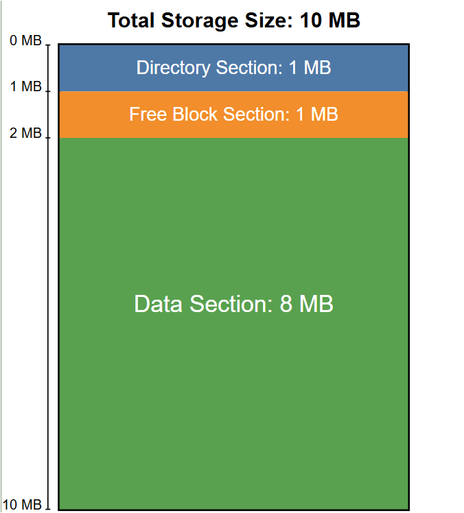
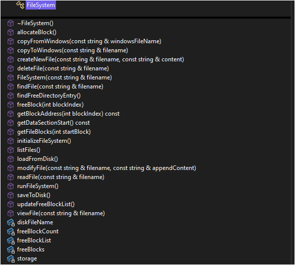

# File Storage System Project Report

Project Report for “File Storage System”

## 1. Introduction

This report documents the development of a virtual file system (VFS) implemented in C++. The goal of this project was to simulate a functional file system within a single 10MB block of memory, supporting basic file operations such as creation, deletion, reading, writing, and listing files. The system emulates low-level storage behaviors to demonstrate the mechanics of file systems typically found in operating systems.

## 2. Problem Statement

In modern operating systems, file systems play a big role in organizing and managing data. To really understand how they work, it helps to actually build one from scratch. This project focuses on creating a simple virtual file system that includes basic features like block allocation, storing metadata, and making sure data is saved correctly. It’s a way to learn the fundamentals by doing, and to get a better idea of how real file systems are designed.

## 3. Objectives

Simulate a file system using a 10MB virtual memory block

Support file operations: create, delete, read, write, copy, and list files

Implement block-based storage with linked allocation

Design for simplicity, modularity, and educational clarity

## 4. System Specifications

Total Storage Size: 10 MB

Directory Section: 1 MB

Free Block Section: 1 MB

Data Section: 8 MB

Block Size: 1 KB

Max Files Supported: 2,097

Max Blocks: 8,192

File Name Length Limit: 100 characters

Directory Entry Size: 500 byte

## 5. System Architecture

The virtual file system divides the 10MB memory space into three major sections:

## 5.1 Directory Section

Stores metadata for each file in fixed-size directory entries (500 bytes). Each entry includes:

File name

Starting block index

File size in bytes

Validity flag

## 5.2 Free Block Section

Tracks free and used data blocks using an integer count of free blocks and a vector indicating block usage

## 5.3 Data Section

Houses actual file data, stored in 1KB blocks. Each block reserves 4 bytes for a pointer to the next block, enabling linked block chains for storing files larger than one block.

## 6. Data Structures

## 6.1 DirectoryEntry

struct DirectoryEntry {

char fileName[FILE_NAME_MAX]; // File name

int startBlock;               // Starting block index of the file data

int fileSize;                 // Size of the file in bytes

bool isValid;                 // Flag to check if this entry is valid

};

## 6.2 FileBlock

struct FileBlock {

int blockIndex;       // Index of this block

int nextBlockIndex;   // Index of the next block, -1 if last block

vector<char> data;    // Block data using vector instead of raw array

};

## 6.3 FileSystem Class

## 7. Key Features

## 7.1 File Creation

Validates duplicate file names

Allocates required number of data blocks

Links blocks and writes content

Updates directory entry

## 7.2 File Deletion

Traverses block chain and frees blocks

Marks directory entry as invalid

## 7.3 File Viewing and Modification

Reconstructs file from linked blocks. Modification is done by appending content.

## 7.4 File Copying

From OS to VFS: Reads external file content and stores it as a virtual file

From VFS to OS: Reconstructs and writes file content to a real OS file

## 7.5 File Listing

Lists all valid files with name and size. Sorts files alphabetically for user clarity.

## 8. Memory Management and Safety

All memory is dynamically allocated using new[]

Proper cleanup in destructor

Data zero-initialized for clean reads

Safe fallbacks in cases of file system corruption or missing data

## 9. User Feedback and Error Handling

Provides clear console messages on success or failure

Descriptive errors for disk full, duplicate names, and missing files

Ensures safe rollback on partial failures (e.g., block allocation errors)

## 10. Limitations and Future Improvements

## 10.1 Limitations

Max file size limited by available blocks

No file name validation (e.g., illegal characters)

File modification is inefficient (requires full deletion and recreation)

No concurrency support

## 10.2 Potential Enhancements

Add timestamp metadata to directory entries

Support for nested directories

Improve file modification with partial block reuse

Implement defragmentation and compaction

## 11. Conclusion

This virtual file system provides a complete simulation of low-level file system mechanics within a 10MB memory buffer. It showcases core principles such as block allocation, metadata management, persistence, and file chaining. The design emphasizes clarity and educational value, making it suitable as a teaching tool or a foundation for further experimentation.

